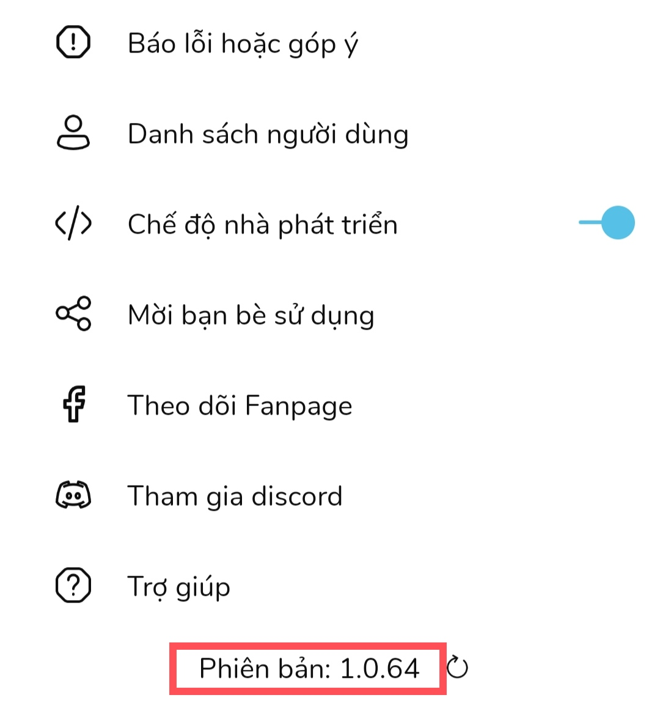
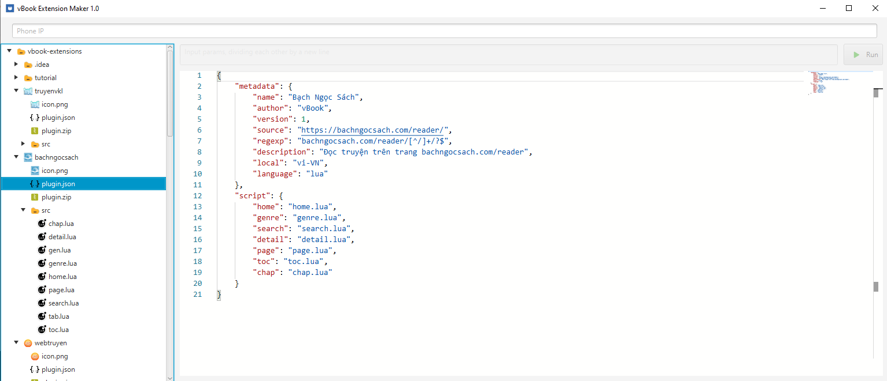
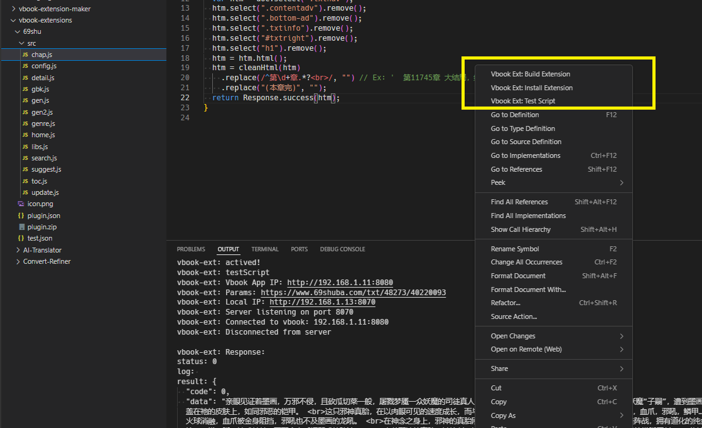

# Cấu trúc của extension

## Thông tin extension

- Tạo một tệp với tên `plugin.json` vào thư mục của extensions, cấu trúc của tệp có dạng như sau

```json
{
  "metadata": {
    "name": "<Tên của extension>",
    "author": "<Tên tác giả>",
    "version": 1,
    "source": "<Địa chỉ trang nguồn>",
    "regexp": "<RegExp khớp với URL của trang truyện>",
    "description": "<Mô tả về extension>",
    "locale": "<Quốc gia áp dụng của extension - Ex: vi_VN, en_US, zh_CN>",
    "tag": "<Thêm nsfw nếu là trang 18+>",
    "type": "<Thể loại của extension, comic/novel/chinese_novel>"
  },
  "script": {
    "home": "<Tên script trang home (không bắt buộc)>",
    "genre": "<Tên script danh sách thể loại, nếu không có thì không thêm>",
    "detail": "<Tên script thông tin truyện (bắt buộc)>",
    "search": "<Tên script tìm kiếm truyện (không bắt buộc)>",
    "page": "<Tên script danh sách trang của mục luc (không bắt buộc)>",
    "toc": "<Tên script mục lục (bắt buộc)>",
    "chap": "<Tên script nội dung chương (bắt buộc)>"
  }
}
```

## Icon extension

- Tạo một ảnh `icon.png` trong thư mục của extension

## Script extension

- Tạo các tệp script đặt tại thư mục `src` của extension

# Cấu trúc script

```javascript
// home trả về các tab hiển thị ở phần khám phá
// home.js
function execute() {
  return Response.success([{ title, input, script }]);
}
// title: Tiêu đề hiển thị
// script: script dùng để lấy content
// input: Giá trị đầu vào của script

// Kết quả của home.js sẽ gọi sang script với ở đây ví dụ tên file là homecontent.js
// url = input
// page = <rỗng>
// homecontent.js - page đầu
function execute(url, page) {
  return Response.success([{ name, link, host, cover, description }], next);
}
// name: Tên truyện
// link: url của truyện
// host:<optional> domain của link, nếu link đã bao gồm domain thì không cần
// cover: url của ảnh cover
// description: mô tả thêm

// Kết quả của page đầu sẽ tiếp tục làm input của page tiếp theo
// url = input từ home.js
// page = next trả về từ page đầu, trường hợp next = <rỗng> hoặc null sẽ dừng load
// homecontent.js - page 2
function execute(url, page) {
  return Response.success([{ name, link, host, cover, description }], next);
}
```

```javascript
// genre trả về danh sách các thể loại
// genre.js
function execute() {
  return Response.success([{ title, input, script }]);
}
// title: Tiêu đề hiển thị
// script: script dùng để lấy content
// input: Giá trị đầu vào của script

// Kết quả của genre.js sẽ gọi sang script với ở đây ví dụ tên file là genrecontent.js
// url = input
// page = <rỗng>
// genrecontent.js - page đầu
function execute(url, page) {
  return Response.success([{ name, link, host, cover, description }], next);
}
// name: Tên truyện
// link: url của truyện
// host:<optional> domain của link, nếu link đã bao gồm domain thì không cần
// cover: url của ảnh cover
// description: mô tả thêm

// Kết quả của page đầu sẽ tiếp tục làm input của page tiếp theo
// url = input từ genre.js
// page = next trả về từ page đầu, trường hợp next = <rỗng> hoặc null sẽ dừng load
// genrecontent.js - page 2
function execute(url, page) {
  return Response.success([{ name, link, host, cover, description }], next);
}
```

```javascript
// detail: Lấy thông tin hiển thị của truyện
// detail.js
// url: url của truyện, url sẽ tự động được bỏ ký tự / ở cuối
function execute(url) {
  return Response.success({
    name,
    cover,
    host,
    author,
    description,
    detail,
    ongoing,
    genres: [{ title, input, script }],
    suggests: [{ title, input, script }],
    comments: [{ title, input, script }],
  });
}
// name: Tên truyện
// cover: Url cover
// host: domain của trang
// author: Tên tác giả
// description: Mô tả của truyện
// detail: Thông tin của truyện
// ongoing: true/false, Trạng thái đang ra của truyện
// genres: <optional>: Trả về list script genre của truyện, cách dùng tương tự mục list genre
// suggests: <optional>: Trả về list script truyện liên quan, cách dùng tương tự phần genre
// comments: <optional>: Trả về list script comments
// comment.js
// function execute(input, next) {
//     return Response.success([
//         {name, content, description}
//     ], next);
// }
```

```javascript
// search trả về kết quả tìm kiếm, trường hợp không có sẽ dùng google seach
// search.js
// key = key search
// page = <rỗng>
// search.js - page đầu
function execute(key, page) {
  return Response.success([{ name, link, host, cover, description }], next);
}
// name: Tên truyện
// link: url của truyện
// host:<optional> domain của link, nếu link đã bao gồm domain thì không cần
// cover: url của ảnh cover
// description: mô tả thêm

// Kết quả của page đầu sẽ tiếp tục làm input của page tiếp theo
// key = key search
// page = next trả về từ page đầu, trường hợp next = <rỗng> hoặc null sẽ dừng load
// search.js - page 2
function execute(key, page) {
  return Response.success([{ name, link, host, cover, description }], next);
}
```

```javascript
// page trả về danh sách các trang của mục lục nếu mục lục được phân thành nhiều trang
// page.js
// url = url truyện giống detail
function execute(url) {
  return Response.success([page1, page2]);
}
```

```javascript
// toc: Trả về mục lục trên từng page
// toc.js
// url: path trả về từ page, nếu không có page thì url là url giống ở detail
function execute(url) {
  return Response.success([{ name, url, host }]);
}
// name: Tên chương
// url: url của chương
// host:<optional> domain của url, nếu url đã bao gồm domain thì không cần
```

```javascript
// chap: trả về nội dung của chương truyện
// chap.js
// url: url trả về từ toc
function execute(url) {
  return Response.success(content);
}
```

# Các function bổ trợ

## Javascript

- Http request

```javascript
var response = fetch(url); // GET equest http return Response
var response = fetch(url, {
  method: "POST", // GET, POST, PUT, DELETE, PATCH
  headers: {
    aaa: "xxx",
    bbb: "yyy",
  },
  body: {
    aaa: "xxx",
    bbb: "yyy",
  },
}); // Full request http với options return Response
let status = response.status; // Http status code
let isSuccess = response.ok; // Check request success (status >= 200 && status < 300)
let headers = response.headers; // Trả về header của response

let doc = response.html(); // Trả về response request dạng Document object
let doc = response.html(charset); // Trả về response request dạng Document object
let text = response.text(); // Trả về response request dạng string
let text = response.text(charset); // Trả về response request dạng string
let json = response.json(); // Trả về response request dạng JSONObject
```

- Html parse

```javascript
Html.parse(text); // Chuyển html text sang Document object
Html.clean(text, ["div", "p"]); // Clean html trừ các thẻ được liệt kê
```

Document selector using [jsoup](https://jsoup.org/cookbook/extracting-data/selector-syntax)

- Response

```javascript
Response.success(data); // Trả về response thành công với data
Response.success(data, data2); // Trả về response thành công với data, data2
Response.error(message); // Trả về response thất bại với nội dung lỗi
```

-- Browser

```javascript
var browser = Engine.newBrowser(); // Khởi tạo browser
browser.setUserAgent(UserAgent.android()); // Tùy chỉnh user agent
browser.launch(url, timeout); // Mở trang web với timeout, trả về Document object
browser.callJs(script, waitTime); // Gọi Javascript function trên trang với waitTime, trả về Document object
browser.urls(); // Trả về các url đã request trên trang
browser.waitUrl(urls, timeout); // Đợi urls load với timeout
browser.html(); // Trả về Document object của trang web
browser.close(); // Đóng browser khi đã xử lý xong
```

-- Other

```javascript
Console.log(); // Log data in tab logcat
load("filename.js"); // Load file js
sleep(10000); // Delay 10 giây
```

# Test extension

- PC cài Java phiên bản 1.8 trở lên
- Kết nối điện thoại và PC cùng 1 mạng lan.
- Trên điện thoại chạm 7 lần vào tên phiên bản để mở tính năng nhà phát triển

  

- Bật `chế độ nhà phát triển` để lấy IP của điện thoại.


- Nhập IP vào tool trên PC



# Cách test extension với VSCode:

- Cài [extension](https://github.com/faea726/vbook-extension-maker/releases/latest) vào VSCode

- Mở một script bất kỳ

- Chuột phải và chọn mục tương ứng.

- Nhập thông tin khi có input box yêu cầu.


