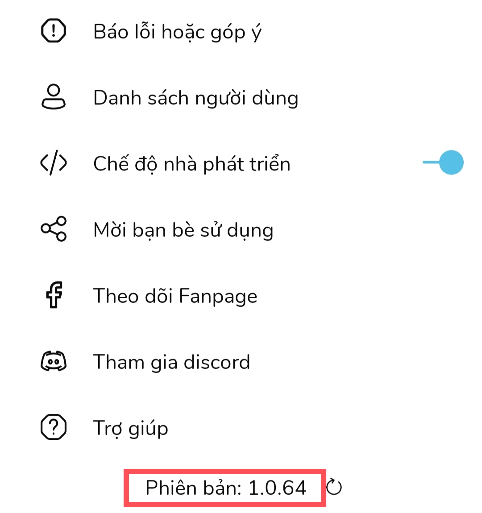
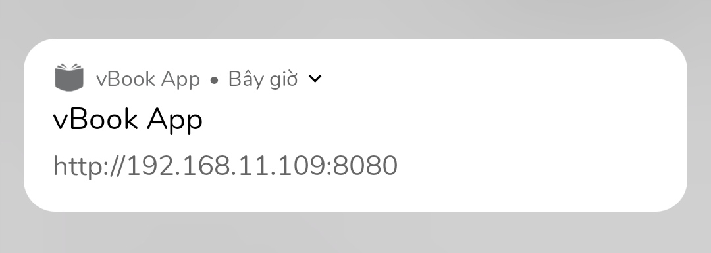
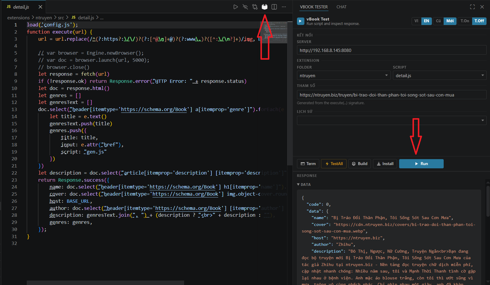

# vBook Extensions

## AI skills

Skill phát triển extension vBook nằm tại
[`.agents/skills/vbook-extensions/`](.agents/skills/vbook-extensions/SKILL.md) theo chuẩn
Agent Skills. Đây là nguồn hướng dẫn chính cho việc tạo, sửa, kiểm thử, audit,
refactor, build và cài đặt extension.

Codex, Gemini CLI, Cursor và GitHub Copilot có thể tự nhận diện skill này. Claude
Code sử dụng entry tương thích tại
[`.claude/skills/vbook-extensions/SKILL.md`](.claude/skills/vbook-extensions/SKILL.md),
sau đó đọc cùng nguồn chuẩn trong `.agents`.

Có thể gọi trực tiếp bằng tên `vbook-extensions`, ví dụ:

```text
Dùng skill vbook-extensions để sửa extension mangadex.
```

API và contract hiện tại của extension được mô tả trong
[`extension-api.md`](extension-api.md).

## Extension tools

CLI dùng chung nằm tại
[`scripts/vbook.js`](.agents/skills/vbook-extensions/scripts/vbook.js). Công cụ kết
nối với vBook developer server để kiểm thử, build và cài đặt extension:

```bash
node .agents/skills/vbook-extensions/scripts/vbook.js connect
node .agents/skills/vbook-extensions/scripts/vbook.js test <extension> <script.js> [args...]
node .agents/skills/vbook-extensions/scripts/vbook.js testall [extension...]
node .agents/skills/vbook-extensions/scripts/vbook.js build <extension> [output.zip]
node .agents/skills/vbook-extensions/scripts/vbook.js install <extension>
```

Chi tiết REST API của developer server: [`extension_docs.md`](extension_docs.md).

## Debug extension với VS Code

### 1. Bật developer server trên điện thoại

- Điện thoại và PC kết nối cùng một mạng LAN.
- Trong app vBook, chạm 7 lần vào tên phiên bản để mở tính năng nhà phát triển.

  

- Bật `Chế độ nhà phát triển` và ghi lại IP:port hiển thị (ví dụ
  `http://192.168.1.10:8080`).

  

### 2. Cài extension vBook Tester (.vsix)

File cài đặt có sẵn trong repo:
[`vbook-vscode-tester-0.0.5.vsix`](vbook-vscode-tester-0.0.5.vsix).

- Cách 1: trong VS Code mở `Extensions` (`Ctrl+Shift+X`) → menu `...` →
  `Install from VSIX...` → chọn file `.vsix` ở trên.
- Cách 2: dùng terminal tại thư mục repo:

  ```bash
  code --install-extension vbook-vscode-tester-0.0.5.vsix
  ```

Reload VS Code sau khi cài.

### 3. Chạy và debug script



1. Mở workspace repo này, mở một file script bất kỳ trong `src/`.
2. Mở panel bằng nút vBook trên thanh tiêu đề editor, hoặc chạy lệnh
   `vBook: Open Tester` (`Ctrl+Shift+P`).
3. Nhập `Server` là IP:port của điện thoại ở bước 1.
4. Chọn `Thư mục` extension, `Script`, nhập `Tham số` rồi bấm `Chạy` để xem response
   JSON và log.
5. `TestAll` kiểm tra nhanh toàn bộ, `Gói` tạo `plugin.zip`, `Cài` cài extension lên
   điện thoại.

Có thể đặt server mặc định trong Settings: `vbookTester.defaultServerUrl`. Chi tiết
xem [`vbook-vscode-tester/README.md`](vbook-vscode-tester/README.md).
