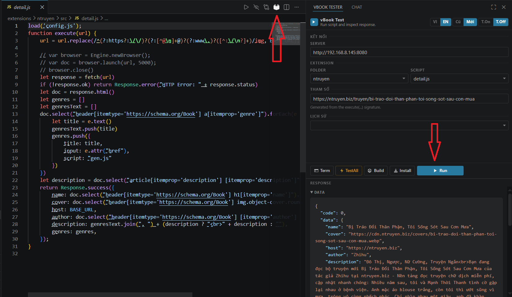

# vBook VSCode Tester

Tiện ích mở rộng VS Code để kiểm thử, đóng gói và cài đặt extension vBook trực tiếp từ môi trường phát triển.

## Tổng quan

`vBook VSCode Tester` cung cấp một giao diện sidebar nhỏ gọn, cho phép bạn:

- chọn thư mục extension trong workspace
- chọn script từ thư mục `src/`
- cấu hình server URL của vBook local API
- truyền tham số vào script
- xem phản hồi JSON trực tiếp
- lưu lại lịch sử các lần chạy gần nhất
- build và cài đặt extension từ VS Code

## Tính năng chính

- Mở được panel `vBook Tester` trong sidebar của VS Code
- Quét workspace để tìm tất cả thư mục extension hợp lệ (có `plugin.json` và `src/`)
- Hiển thị các script tồn tại trong `src/` để chọn nhanh
- Tự động sinh form tham số từ chữ ký `execute(...)` nếu có
- Chạy script theo hai chế độ API: `Cũ` hoặc `Mới`
- Bật/tắt tự động mở Terminal khi chạy
- Gọi các thao tác:
  - `Run` để thực thi script và hiển thị response
  - `TestAll` để chạy kiểm tra toàn bộ
  - `Build` để tạo `plugin.zip`
  - `Install` để cài extension lên server
- Ghi nhớ server URL, thư mục, script và các input đã dùng

## Cách sử dụng

1. Trong cửa sổ mới, mở workspace chứa extension vBook của bạn.
2. Mở `vBook Tester` từ Activity Bar hoặc chạy lệnh `vBook: Open Tester`.
3. Trong panel:
   - Nhập `Server` là địa chỉ vBook API (mặc định `http://127.0.0.1:8080`).
   - Chọn `Thư mục` extension cần kiểm thử.
   - Chọn `Script` trong danh sách file nguồn.
   - Nhập tham số vào phần `Tham số`.
   - Chọn từ `Lịch sử` nếu muốn dùng lại input trước đó.
4. Nhấn `Chạy` để thực hiện script và xem kết quả ở khung phản hồi.
5. Dùng `Gói` để xuất `plugin.zip`, hoặc `Cài` để cài extension lên điện thoại.

## Các nút chức năng

- `Term`: mở Terminal riêng để xem log chi tiết
- `TestAll`: chạy toàn bộ bước kiểm thử (one-click)
- `Gói`: build package `plugin.zip` từ thư mục extension
- `Cài`: cài extension lên server vBook
- `Chạy`: gửi request thực thi script và trả về dữ liệu

## Cấu hình

Bạn có thể cấu hình trong `Settings` của VS Code:

- `vbookTester.defaultServerUrl`: URL mặc định cho server local
- `vbookTester.showTerminalOnRun`: tự động hiển thị terminal khi chạy
- `vbookTester.maxHistory`: số lượng lịch sử chạy gần nhất lưu lại

## Ghi chú

- Extension hợp lệ khi thư mục chứa cả `plugin.json` và thư mục `src/`.
- Nếu có file `icon.png`, extension sẽ gửi icon cùng payload khi build/install.
- Người dùng có thể chuyển đổi ngôn ngữ hiển thị `VI` / `EN` ngay trên panel.

